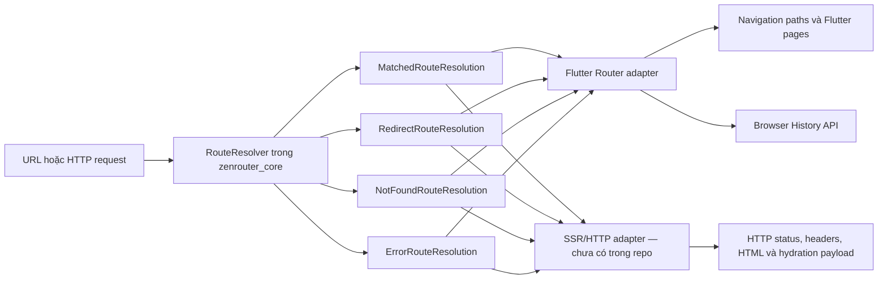
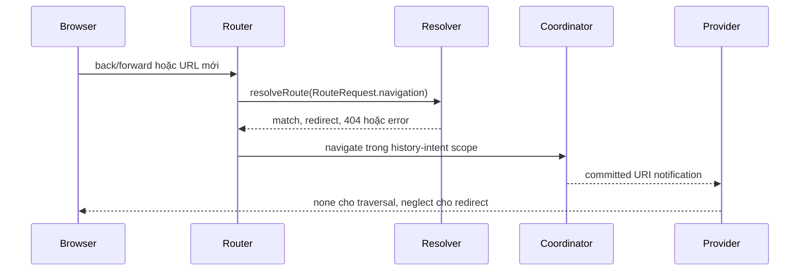
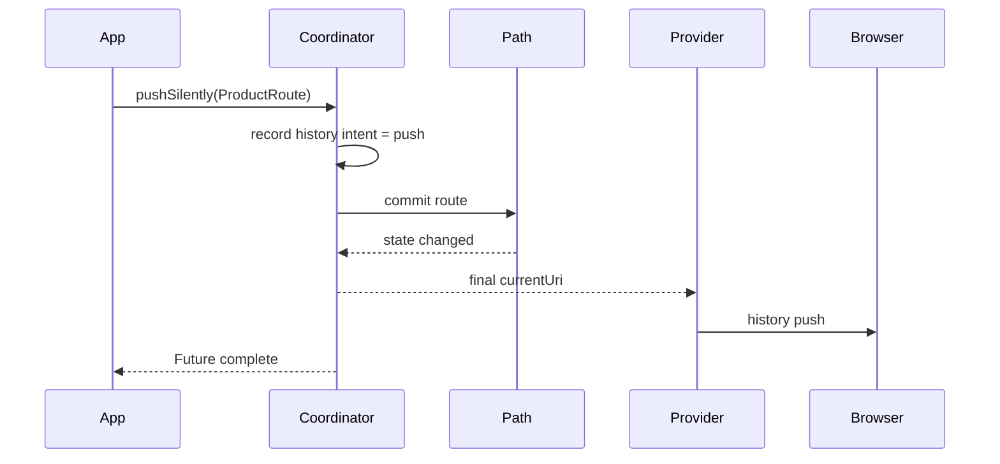

# ZenRouter Web Navigation Backbone — Technical Report

**Ngày:** 2026-08-14  
**Phạm vi:** `zenrouter_core`, `zenrouter`, `zenrouter_file_annotation`, `zenrouter_file_generator`  
**Trạng thái:** Đã triển khai trong working tree, chưa phải bản phát hành chính thức  
**Mục tiêu:** Đánh giá và xử lý các điểm thiết kế khiến ZenRouter chưa phù hợp làm routing backbone dùng chung cho SPA và SSR.

## 1. Executive summary

ZenRouter ban đầu được thiết kế chủ yếu quanh Flutter Navigator và imperative stack navigation. Mô hình này hoạt động tốt cho ứng dụng Flutter truyền thống, nhưng có một số contract không đủ chặt để làm backbone cho web navigation:

- Browser history bị suy diễn từ thay đổi Flutter stack thay vì được mô hình hóa như một intent độc lập.
- `push()` vừa đại diện cho việc commit route, vừa đại diện cho kết quả khi route bị pop trong tương lai.
- Parser chỉ trả về route hoặc `null`, không biểu diễn được HTTP status, headers, redirect và loader/hydration data.
- Các lần `setNewRoutePath()` đồng thời có thể hoàn tất sai thứ tự.
- Value equality, lifecycle identity và Flutter page identity bị trộn lẫn.
- URL generator ghép chuỗi trực tiếp, làm hỏng round-trip với reserved characters.
- 404 generated route đổi URL sang `/not-found`, làm mất URI thực tế được request.
- Declarative diff và reset route có thể phát trạng thái trung gian, làm mất page state hoặc notify Router trong Flutter build phase.

Thay đổi hiện tại đã tạo một routing kernel adapter-neutral trong `zenrouter_core`, sửa semantics của SPA history và navigation commit, đồng thời củng cố identity, URL, lifecycle và module ordering.

Kết luận kỹ thuật:

> ZenRouter hiện có thể đóng vai trò routing backbone cho SPA và làm kernel cho SSR adapter. Kernel đã có versioned hydration envelope, nhưng repository chưa cung cấp HTTP server adapter, HTML renderer hoặc application-specific hydration schema, nên chưa thể được gọi là một SSR framework production-ready.

## 2. Mục tiêu và non-goals

### 2.1 Mục tiêu

- Một request phải được resolve mà không phụ thuộc Flutter UI.
- Browser push, replace và back/forward phải có semantics rõ ràng.
- Navigation API dùng bởi Router phải hoàn tất khi state đã commit.
- Redirect, 404 và error phải là typed outcomes.
- URL phải round-trip chính xác giữa route parameters và `Uri`.
- Route value identity không được phụ thuộc mutable lifecycle state.
- Declarative navigation không được làm lộ intermediate state.
- Các module phải được match theo thứ tự xác định.

### 2.2 Non-goals của thay đổi hiện tại

- Không xây HTTP server hoặc reverse proxy integration.
- Không render Flutter widget thành HTML phía server.
- Không định nghĩa application-specific hydration schema cho từng domain.
- Không triển khai loader cache, revalidation, action/mutation hoặc streaming SSR.
- Không thay `RouteTarget` hoặc navigation stack runtime bằng route graph.

## 3. Vấn đề thiết kế ban đầu

| ID | Vấn đề | Tác động SPA | Tác động SSR | Trạng thái |
|---|---|---|---|---|
| D1 | Browser history và Flutter stack dùng chung một tín hiệu | Push/replace/back có thể bị báo sai | Không trực tiếp | Đã xử lý |
| D2 | `push()` chờ đến lúc route bị pop | Router future không phản ánh commit | Request lifecycle có thể bị treo | Đã xử lý |
| D3 | Parser chỉ trả route hoặc `null` | Redirect/404 thiếu semantics | Không có status, headers, data | Đã xử lý bằng resolution seam |
| D4 | `setNewRoutePath()` không serialize | Race giữa deep links/back-forward | Không trực tiếp | Đã xử lý |
| D5 | Equal routes có hash khác nhau | Map, Set và diff không ổn định | Cache key không đáng tin cậy | Đã xử lý |
| D6 | Semantic equality được dùng làm page key | Duplicate key hoặc reuse sai page | Không trực tiếp | Đã xử lý |
| D7 | URL codegen ghép chuỗi | Reserved characters phá route | Canonical URL sai | Đã xử lý |
| D8 | Generated 404 đổi sang `/not-found` | Address bar mất requested URI | HTTP 404 không canonical | Đã xử lý |
| D9 | Reset/diff không atomic và cleanup không đầy đủ | Flicker, mất state, build-phase error | State snapshot không ổn định | Đã xử lý ở path layer |
| D10 | Module order dựa trên collection không được contract hóa | Match phụ thuộc iteration order | Request routing không deterministic | Đã xử lý |
| D11 | Route graph vẫn implicit trong parser/layout hooks | Tooling và prefetch khó | Static manifest khó tạo | Đã xử lý bằng `RouteManifest` |
| D12 | Presentation route vẫn gắn Flutter ở package UI | Không vấn đề | Server không thể phụ thuộc package UI | Có seam; cần SSR adapter riêng |

## 4. Kiến trúc sau thay đổi



Điểm quan trọng là route resolution không còn phải biết request sẽ được render bằng Flutter Navigator hay HTTP renderer. Adapter quyết định cách biến cùng một resolution thành browser state hoặc server response.

## 5. Thiết kế chi tiết

### 5.1 Adapter-neutral route resolution

Contract mới nằm tại:

- `zenrouter_core/lib/src/routing/resolution.dart`
- `CoordinatorCore.resolveRoute()`

`RouteRequest` chứa:

- `uri`
- HTTP `method`
- immutable, lowercase `headers`
- optional `body`
- adapter-owned `state`
- cooperative `cancellationToken`

`RouteResolution<T>` là sealed hierarchy:

```dart
sealed class RouteResolution<T extends RouteUri> { ... }

final class MatchedRouteResolution<T extends RouteUri>
    extends RouteResolution<T> { ... }

final class RedirectRouteResolution<T extends RouteUri>
    extends RouteResolution<T> { ... }

final class NotFoundRouteResolution<T extends RouteUri>
    extends RouteResolution<T> { ... }

final class ErrorRouteResolution<T extends RouteUri>
    extends RouteResolution<T> { ... }
```

Mỗi outcome có thể mang:

- `statusCode`
- immutable response `headers`
- versioned `RouteHydrationPayload` cho loader/hydration data
- route, redirect location hoặc error tùy outcome

Backward compatibility được giữ bằng default implementation:

1. Gọi `parseRouteFromUri()` cũ.
2. Route hợp lệ trở thành status 200.
3. `null` trở thành typed 404.
4. Route mix `RouteNotFound` trở thành typed 404 có renderable route.
5. Exception trở thành typed 500 và giữ `StackTrace`.

Ứng dụng có thể override `resolveRoute()` để dùng đầy đủ request context:

```dart
@override
Future<RouteResolution<AppRoute>> resolveRoute(RouteRequest request) async {
  if (!session.isAuthenticated && request.uri.path != '/login') {
    return RedirectRouteResolution(
      request: request,
      location: Uri.parse('/login'),
      statusCode: 302,
    );
  }

  final route = await parseRouteFromUri(request.uri);
  if (route == null) {
    return NotFoundRouteResolution(request: request);
  }

  final loaderData = await loadDataFor(route);
  return MatchedRouteResolution(
    request: request,
    route: route,
    hydration: RouteHydrationPayload(
      routeUri: request.uri,
      data: loaderData,
    ),
  );
}
```

`RouteHydrationPayload` chỉ chấp nhận JSON-compatible values, deep-freeze toàn bộ collection, và encode envelope gồm `schema`, `version`, `route`, `data`. Payload version không được runtime hỗ trợ sẽ bị reject thay vì hydrate âm thầm sai schema.

### 5.2 Navigation commit và pop result

Contract cũ của `push()` có hai thời điểm khác nhau:

1. Route được thêm vào stack.
2. Future hoàn tất khi route bị pop, có thể rất lâu sau đó.

Flutter page code cần thời điểm số 2 để nhận result, nhưng Router, deep-link handler và SSR-style orchestration cần thời điểm số 1.

Giải pháp là giữ `push()` cho result semantics và thêm `pushSilently()` cho commit semantics:

| API | Future hoàn tất khi | Use case |
|---|---|---|
| `push<R>()` | Route bị pop và trả result | Dialog/form flow |
| `pushSilently()` | Route đã được commit vào stack | Router, deep link, orchestration |

`navigate()` và built-in deep-link push strategy hiện sử dụng commit-only API, nên không còn treo chờ một lần pop trong tương lai.

### 5.3 Serialize browser navigation

`CoordinatorRouterDelegate` dùng generation và `RouteCancellationToken` cho resolution, sau đó serialize riêng commit phase:

```text
/slow ── resolve ── cancelled
/next ───── resolve ── atomic commit
```

Đặc tính hiện tại:

- Request mới supersede resolution cũ chưa commit.
- Resolver/loader có thể dừng sớm qua `cancellationToken`.
- Failure của một operation không làm hỏng commit queue cho operation kế tiếp.
- Future chỉ hoàn tất sau khi resolution và navigation state đã commit.
- Redirect loop được phát hiện bằng tập URI đã đi qua.
- Typed errors được rethrow với stack trace gốc.

Một commit đã bắt đầu không bị hủy giữa chừng; request mới sẽ chờ commit atomically rồi áp dụng state mới. Cancellation là control flow bình thường và không bị chuyển thành typed 500.

### 5.3.1 Coordinator transaction boundary

Mọi coordinator mutation chạy qua `runNavigationTransaction()`. Nested transaction join outer transaction; concurrent top-level transaction được serialize bằng queue và Zone ownership. Listener của coordinator nhận một `NavigationCommit` gồm revision tăng đơn điệu, URI trước/sau và history intent. No-op không phát commit; mutation đã xảy ra trước exception vẫn được publish trước khi error gốc được rethrow.

### 5.4 Browser history intent

Core định nghĩa intent riêng cho external history:

```dart
enum NavigationHistoryIntent {
  automatic,
  push,
  replace,
  traverse,
}
```

Flutter adapter ánh xạ:

| ZenRouter intent | Flutter reporting type | Browser effect |
|---|---|---|
| `push` | `navigate` | Thêm history entry |
| `replace` | `neglect` | Thay current entry |
| `traverse` | `none` | Không tạo entry khi back/forward |
| `automatic` | Fallback từ Flutter | Compatibility |

Browser-originated navigation chạy trong `runNavigationTransaction(..., historyIntent: traverse)`. Typed redirect đổi outer transaction scope sang replace, tránh tạo thêm history entry cho URL trung gian.



Để dùng behavior này, Flutter app nên cấu hình:

```dart
MaterialApp.router(routerConfig: coordinator)
```

Nếu app tự lắp `routerDelegate` và `routeInformationParser` nhưng không dùng `CoordinatorRouteInformationProvider`, history intent mới sẽ không được consume.

### 5.5 Ba lớp identity

Thay đổi tách ba khái niệm trước đây bị trộn:

| Identity | Định nghĩa | Dùng cho |
|---|---|---|
| Route value identity | `runtimeType + props` | Match, diff, Set/Map |
| Lifecycle entry identity | `identical(a, b)` | Ownership, result, disposal |
| Flutter page identity | `ObjectKey(route)` | Navigator page entry |

Path binding và result completer không tham gia `hashCode`. Điều này sửa invariant bắt buộc của Dart:

```text
a == b  ⇒  a.hashCode == b.hashCode
```

Hai route có cùng value vẫn có thể cùng tồn tại như hai stack entries riêng vì Flutter page key dựa trên object identity.

### 5.6 Atomic declarative diff và lifecycle cleanup

`StackMutatable.replaceAll()` thay toàn bộ stack như một observable mutation:

- Route được giữ lại theo object identity không bị dispose.
- Route bị loại bỏ gọi `onDiscard()` và được unbind khỏi path.
- Route mới được bind trước khi state được publish.
- Listener chỉ nhận một committed stack, không nhận intermediate empty stack.

`applyDiff()` hiện dùng atomic replacement cho insert/mixed operations. Việc này sửa hai lỗi thực tế được full suite phát hiện:

- Retained pages bị build lại vì reset phát một empty state trung gian.
- Navigator/Router nhận notification trong Flutter build phase.

`NavigationPath.reset()` hiện:

- Discard toàn bộ route-owned resources.
- Complete pending route results an toàn.
- Clear stack binding.
- Publish notification bằng microtask, hoạt động cả khi không có Flutter binding.

### 5.7 URL round-trip

Generator cũ tạo URI bằng string interpolation:

```dart
Uri.parse('/users/$userId')
```

Nếu `userId` chứa `/`, `?`, `#`, `%` hoặc khoảng trắng, giá trị có thể bị hiểu thành cấu trúc URL thay vì một path parameter.

Generator mới dùng:

```dart
Uri(pathSegments: ['users', userId])
```

Catch-all dùng spread để mỗi phần tử được encode độc lập:

```dart
Uri(pathSegments: ['docs', ...slugs])
```

Query parameters được apply sau khi base URI đã được tạo. Root route được canonical hóa thành `Uri(path: '/')`.

### 5.8 Canonical 404

Generated `NotFoundRoute` hiện:

- Mix `RouteNotFound` để resolver trả status 404.
- Giữ URI gốc trong `toUri()`.
- Không redirect address bar sang `/not-found`.

Ví dụ request `/products/missing?ref=email` có thể:

- Render custom not-found route.
- Giữ nguyên URL `/products/missing?ref=email`.
- Trả HTTP status 404 trong server adapter.

### 5.9 Deterministic module ordering

`CoordinatorModular.defineModules()` trả `Iterable<RouteModule<T>>` và được snapshot thành immutable ordered list.

Thay đổi này đảm bảo:

- Parser thử module theo đúng declaration order.
- Cùng input luôn chọn cùng module.
- Duplicate module runtime type ném `StateError` thay vì âm thầm overwrite trong Map.

### 5.10 Declarative Route Manifest

`zenrouter_core` cung cấp `RouteManifest` bất biến và không phụ thuộc Flutter.
Manifest chứa route/layout ID, URI pattern và parent relationship. Module này sở hữu:

- Deterministic matching cho literal, dynamic và rest parameters.
- Duplicate/equally-specific ambiguous pattern detection.
- Layout reference và parent-cycle validation.
- Reverse routing không cần tạo presentation route.
- Versioned JSON encode/decode cho tooling và devtools.
- Composition của các manifest độc lập.

`RouteManifestFragment<I>` là contribution seam cho `RouteModule`. Fragment chỉ
validate local shape và ID uniqueness; `CoordinatorModular` flatten fragment
của nested module rồi tạo một root manifest duy nhất. Parent/layout reference,
indexed child, cycle và ambiguous URI pattern được validate sau composition,
khi toàn bộ application graph đã hiện diện.

Typed ID không bị đổi thành string khi compose. Root graph dùng `Object` như
union type ở interface, nhưng giá trị vẫn là enum/domain object ban đầu nên Dart
object pattern và reverse routing tiếp tục hoạt động. Nếu mọi fragment có
`RouteIdCodec`, composite codec scope wire ID theo fragment name để JSON có thể
round-trip qua SSR/tooling seam.

ID trong memory được generic hóa qua `RouteManifest<I>`. Handwritten
coordinator có thể dùng enum hoặc domain value và destructure trực tiếp bằng
Dart object pattern trên `RouteManifestMatch.id`. `RouteIdCodec<I>` chỉ chuyển
ID typed sang stable string khi encode/decode JSON; serialization concern không
còn rò vào matching hoặc reverse-routing interface.

File generator sinh `Coordinator.manifest`, mix `RouteModuleBinding`,
emit `RouteBinding` / `RouteBinding.deferred`, và sinh
`coordinator.location.{route}` helpers.
Widget, `BuildContext`, transition và constructor closure không đi vào manifest.
Hand-written coordinator vẫn tương thích qua `RouteManifest.empty` và có thể
override `routeManifest` khi muốn khai báo topology tĩnh.

### 5.11 Runtime Route Binding Registry

`RouteBinding<I, T>` ánh xạ một manifest ID sang factory tạo `Route Target` từ
`RouteManifestMatch`. `RouteBindingRegistry<I, T>` snapshot và validate toàn bộ
binding set khi khởi tạo:

- Reject duplicate binding ID.
- Reject ID không tồn tại hoặc trỏ vào layout.
- Reject manifest route chưa có binding.
- Hỗ trợ sync/async factory và optional not-found binding.
- Compose an toàn các binding có feature-owned typed ID vào root registry dùng
  `Object` ID view.

`RouteModuleBinding<T, I>` là adapter tại RouteModule seam (coordinator
implement RouteModule nên dùng chung mixin): nó expose manifest từ registry
và implement `parseRouteFromUri()` bằng manifest matching rồi binding. Code
cũ tự override parser tiếp tục hoạt động vì mixin là opt-in.

## 6. SPA flow sau thay đổi

### 6.1 Programmatic push



### 6.2 Replace

`replace()` ghi replace intent, cleanup các route cũ, tạo lại layout chain cần thiết và activate target route. Browser provider dùng replace semantics thay vì thêm một entry mới.

### 6.3 Back/forward

Inbound route path được serialize. Nếu target đã có trong mutable stack, ZenRouter pop về target; nếu chưa có, route được commit mới. Toàn bộ operation giữ traversal intent để không tạo vòng lặp history.

## 7. SSR flow dự kiến

Server adapter có thể được xây mà chỉ phụ thuộc `zenrouter_core`:

```dart
Future<HttpResponse> handle(HttpRequest httpRequest) async {
  final request = RouteRequest(
    uri: httpRequest.uri,
    method: httpRequest.method,
    headers: normalizeHeaders(httpRequest.headers),
    body: await readBody(httpRequest),
  );

  final resolution = await coordinator.resolveRoute(request);

  return switch (resolution) {
    RedirectRouteResolution(:final location, :final statusCode) =>
      redirectResponse(location, statusCode),
    MatchedRouteResolution(:final route, :final hydration) =>
      renderResponse(route, hydration, statusCode: resolution.statusCode),
    NotFoundRouteResolution(:final route, :final hydration) =>
      renderNotFound(route, hydration, statusCode: resolution.statusCode),
    ErrorRouteResolution(:final error, :final stackTrace) =>
      renderError(error, stackTrace, statusCode: resolution.statusCode),
  };
}
```

Đoạn trên minh họa integration point; `HttpResponse`, HTML renderer và cách embed payload an toàn vào HTML chưa được cung cấp bởi repository. JSON hydration envelope và codec đã nằm trong core.

## 8. API và compatibility impact

### 8.1 Breaking hoặc observable changes

- `PageCallback` nhận `LocalKey` thay cho `ValueKey<RouteTarget>`.
- `RouteTarget.hashCode` thay đổi để tuân theo value equality contract.
- `RouteTarget.deepEquals()` giờ là reference identity.
- `CoordinatorModular.defineModules()` có contract `Iterable`; implementation trả `Set` vẫn hợp lệ nếu giữ override tương thích.
- `Coordinator.pushOrMoveToTop()` trả `Future<void>`.
- Generated route code thay đổi; consumer dùng file-based routing cần regenerate code.

### 8.2 Additive APIs

- `RouteRequest`
- `RouteResolver<T>`
- `RouteResolution<T>` hierarchy
- `RouteNotFound`
- `RouteCancellationToken`
- `RouteHydrationPayload`
- `RouteManifest`, `RouteManifestRoute`, `RouteManifestLayout`
- `RouteManifestFragment`
- `RoutePattern` và `RouteManifestMatch`
- `RouteIdCodec<I>`
- `RouteBinding<I, T>` và `RouteBindingRegistry<I, T>`
- `RouteModuleBinding<T, I>`
- `NavigationCommit`
- `NavigationHistoryIntent`
- `CoordinatorCore.withHistoryIntent()`
- `StackMutatable.pushSilently()`
- `CoordinatorMutatable.pushSilently()`
- `StackMutatable.replaceAll()`
- `CoordinatorCore.runNavigationTransaction()`

### 8.3 Compatibility bridge

Các coordinator chỉ implement `parseRouteFromUri()` vẫn hoạt động vì `CoordinatorCore.resolveRoute()` cung cấp default adapter. App chỉ cần override resolver khi cần request headers, explicit redirect, status code hoặc loader data.

## 9. Verification

Các kiểm tra cuối cùng:

```text
fvm flutter analyze
No issues found

fvm flutter test \
  packages/zenrouter_core/test \
  packages/zenrouter/test \
  packages/zenrouter_file_generator/test

968 tests passed, 5 skipped
```

Test coverage mới bao gồm:

- Equal routes có hash bằng nhau.
- Lifecycle identity tách khỏi value identity.
- Commit-only navigation không chờ pop result.
- Deep-link push strategy hoàn tất sau commit.
- Browser history intent mapping và scoped traversal.
- Unresolved route information bị supersede; cooperative cancellation đến resolver.
- Concurrent coordinator mutations serialize, nested mutations chỉ phát một commit.
- Typed redirect và error propagation với stack trace gốc.
- Redirect method/body semantics cho 301, 302, 303, 307 và 308.
- Match, 404, 500 và immutable headers trong core resolution.
- Versioned hydration round-trip, deep immutability và schema rejection.
- Route manifest matching, reverse routing, graph validation, composition và
  versioned JSON round-trip.
- Enum/domain route IDs, object-pattern binding và wire-codec collision
  rejection.
- Generated Flutter parser/binding và static reverse links dùng chung manifest.
- URL generation cho dynamic, catch-all, root, query và reserved characters.
- Atomic diff giữ page instance và chỉ notify một lần.
- Reset cleanup resource, result completer và stack binding.
- Duplicate module type bị reject.
- Layout reset hoạt động trong widget build và headless test.

## 10. Rủi ro và phần còn thiếu

### 10.1 Production SSR adapter

Chưa có package chịu trách nhiệm:

- Chuyển `dart:io` hoặc framework-specific HTTP request thành `RouteRequest`.
- Chuyển resolution thành HTTP response.
- Render HTML hoặc streaming output.
- Embed hydration JSON an toàn vào HTML response.
- Bảo đảm CSP, cache-control và security headers.

### 10.2 Hydration contract

`RouteHydrationPayload` hiện cung cấp immutable JSON envelope với schema version và route identity. Production SSR vẫn cần:

- Domain schema cho data của từng route.
- Error redaction giữa server và browser.
- XSS-safe JSON embedding.

### 10.3 Loader và mutation model

Chưa có first-class concepts cho:

- Route loader.
- Form action/mutation.
- Cache key và stale policy.
- Revalidation sau mutation.
- Timeout và cancellation adapter cho remote I/O không hỗ trợ token trực tiếp.

### 10.4 Declarative route graph

Route graph không còn chỉ tồn tại ngầm trong generated parser. `RouteManifest`
hiện là source of truth cho generated URI matching và link generation:

- Generator validate duplicate/ambiguous patterns trước khi emit code.
- Static link helpers không cần presentation route instance.
- Layout topology có thể được SSR/tooling đọc.
- Manifest có versioned JSON representation cho devtools.

Phần chưa triển khai là UI visualization trong `zenrouter_devtools` và executor
cho prefetch/preload plan; manifest đã cung cấp dữ liệu cần thiết cho hai adapter
này.

### 10.5 Direct path listeners

Coordinator listeners hiện nhận atomic `NavigationCommit`. Consumer đăng ký trực tiếp vào từng `StackPath` vẫn quan sát path-level mutations; loại listener này nên dành cho renderer nội bộ. Analytics, external stores và SSR snapshots nên nghe coordinator commit seam.

## 11. Đề xuất roadmap

### Phase 1 — Hoàn thiện routing kernel

- [x] Thêm navigation transaction boundary.
- [x] Thêm cancellation token/generation cho Router queue.
- [x] Chuẩn hóa redirect method semantics: 301, 302, 303, 307, 308.
- [x] Định nghĩa serializable hydration payload.

### Phase 2 — Route manifest

- [x] Generator xuất immutable route graph.
- [x] Validate ambiguous routes và duplicate patterns tại build time.
- [x] Expose reverse routing/link builder không phụ thuộc presentation route.

### Phase 3 — SSR adapter

- Tạo package server adapter chỉ phụ thuộc `zenrouter_core`.
- Map HTTP requests/responses.
- Cung cấp HTML/hydration renderer interface.
- Thêm integration tests cho redirect, 404, 500, headers và hydration.

### Phase 4 — Production hardening

- Navigation cancellation và timeout.
- Loader cache/revalidation.
- Observability: trace id, resolution timing, loader timing.
- Security review cho headers, serialized state và error exposure.

## 12. Kết luận

Các lỗi contract quan trọng nhất ngăn ZenRouter làm web navigation backbone đã được xử lý:

- Routing decision tách khỏi rendering adapter.
- Browser history có explicit intent.
- Router chờ commit thay vì pop result.
- Concurrent navigation có ordering xác định.
- Redirect, 404 và error là typed outcomes.
- Identity, URL và lifecycle tuân theo invariant ổn định.

ZenRouter hiện đủ nền tảng để làm SPA routing backbone và core resolver cho SSR.
Phase 1 của routing kernel và Phase 2 Route Manifest đã hoàn tất. Bước tiếp theo
không nên tiếp tục nhồi server behavior vào Flutter `Coordinator`; nên tạo SSR
adapter riêng trên `RouteResolver`, `RouteManifest` và
`RouteHydrationPayload`.
